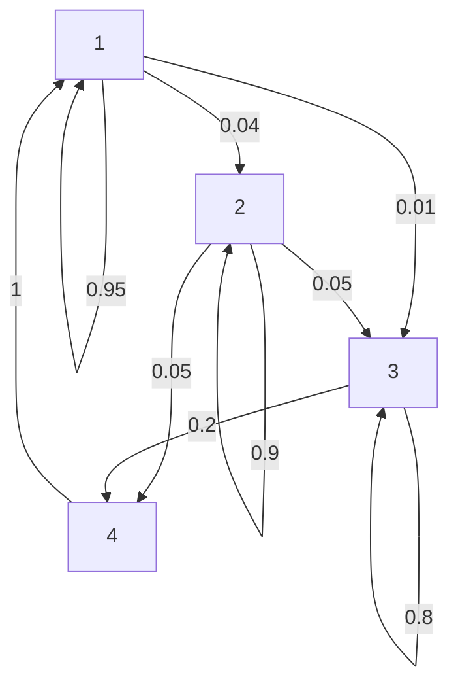

# SSDP-2-Projet : Analyse de Graphes et Chaînes de Markov

## 📋 Description

Ce projet est une implémentation en C pour l'analyse de graphes orientés et de chaînes de Markov. Il fournit des outils pour :
- Charger et représenter des graphes via des listes d'adjacence
- Détecter les composantes fortement connexes (algorithme de Tarjan)
- Générer des diagrammes de Hasse
- Calculer des distributions stationnaires pour les chaînes de Markov
- Visualiser les graphes au format Mermaid

## 🎯 Fonctionnalités principales

### 1. **Structures de données**
- **Liste d'adjacence** : Représentation efficace des graphes orientés pondérés
- **Matrices** : Support pour les calculs matriciels et les chaînes de Markov
- **Partitions** : Organisation des sommets en classes (composantes connexes)
- **Listes de liens** : Gestion des liens inter-classes

### 2. **Algorithmes implémentés**

#### Algorithme de Tarjan
- Détection des composantes fortement connexes (SCC)
- Complexité : O(V + E)
- Utilise une pile pour le parcours en profondeur

#### Diagramme de Hasse
- Réduction transitive des liens entre classes
- Suppression des chemins indirects
- Génération de la structure minimale du graphe

#### Analyse de Markov
- Validation des chaînes de Markov (somme des probabilités = 1)
- Calcul de la distribution stationnaire
- Extraction de sous-matrices par classe

### 3. **Import/Export**
- Chargement de graphes depuis des fichiers texte
- Export au format Mermaid pour visualisation
- Support de différents formats d'exemple

## 🏗️ Structure du projet

```
SSDP-2-Projet/
├── src/
│   ├── main.c                 # Point d'entrée du programme
│   ├── adjacency_list.c/h     # Gestion des listes d'adjacence
│   ├── tarjan.c/h             # Algorithme de Tarjan (SCC)
│   ├── hasse.c/h              # Génération du diagramme de Hasse
│   ├── matrix.c/h             # Opérations matricielles
│   ├── partition.c/h          # Gestion des partitions
│   ├── class.c/h              # Structure de classe
│   ├── links.c/h              # Gestion des liens inter-classes
│   ├── file_loader.c/h        # Chargement de fichiers
│   ├── vertex.c/h             # Structure de sommet
│   ├── cell.c/h               # Cellule de liste
│   └── list.c/h               # Liste chaînée
├── data/                      # Fichiers d'exemples
├── export/                    # Fichiers de sortie
├── build/                     # Répertoire de compilation
└── CMakeLists.txt            # Configuration CMake
```

## 📦 Compilation et Installation

### Prérequis
- CMake (version 3.31.6 ou supérieure)
- Compilateur C (GCC, MSVC, MinGW, etc.)
- Standard C11

### Compilation avec CMake

```bash
# Créer le répertoire de build
mkdir build
cd build

# Configurer le projet
cmake ..

# Compiler
cmake --build .
```

### Compilation avec GCC (alternative)

```bash
gcc -std=c11 -o SSDP_2_Projet *.c -lm
```

## 🚀 Utilisation

### Format des fichiers d'entrée

Les fichiers de graphes doivent suivre ce format :

```
<nombre_de_sommets>
<source> <destination> <poids>
<source> <destination> <poids>
...
```

**Exemple** (`data/exemple1.txt`) :
```
4
1 1 0.95
1 2 0.04
1 3 0.01
2 2 0.9
2 3 0.05
2 4 0.05
3 3 0.8
3 4 0.2
4 1 1
```

- **Ligne 1** : 4 sommets
- **Lignes suivantes** : Arêtes (source, destination, probabilité)
- Les indices commencent à 1
- Les poids doivent être entre 0 et 1 pour les chaînes de Markov

### Exemple d'utilisation dans le code

```c
// Charger un graphe depuis un fichier
t_adj_list* adj_list = list_import("data/exemple1.txt");

// Afficher le graphe
print_adj_list(adj_list);

// Valider si c'est une chaîne de Markov valide
validate_adj_list(adj_list);

// Appliquer l'algorithme de Tarjan
t_partition partition = tarjan(adj_list);
print_partition(&partition);

// Trouver les liens inter-classes
t_link_list links = find_inter_class_links(adj_list, partition);

// Réduire les liens transitifs (Hasse)
remove_transitive_links(&links);

// Générer le diagramme Mermaid
generate_hasse_mermaid_file(&links, "export/hasse_diagram.txt");

// Nettoyer la mémoire
free_link_list(&links);
delete_partition(&partition);
free_adj_list(adj_list);
```

## 📊 Fonctions principales

### Gestion des graphes

| Fonction | Description |
|----------|-------------|
| `list_import(filename)` | Charge un graphe depuis un fichier |
| `create_empty_adj_list(size)` | Crée une liste d'adjacence vide |
| `add_cell_to_adj_list(list, src, dest, weight)` | Ajoute une arête |
| `print_adj_list(list)` | Affiche la liste d'adjacence |
| `validate_adj_list(list)` | Valide une chaîne de Markov |
| `generate_mermaid_file(list, filename)` | Exporte au format Mermaid |

### Algorithme de Tarjan

| Fonction | Description |
|----------|-------------|
| `tarjan(adj_list)` | Calcule les composantes fortement connexes |
| `create_partition()` | Crée une partition vide |
| `print_partition(partition)` | Affiche les classes de la partition |
| `delete_partition(partition)` | Libère la mémoire d'une partition |

### Diagramme de Hasse

| Fonction | Description |
|----------|-------------|
| `find_inter_class_links(list, partition)` | Trouve les liens entre classes |
| `remove_transitive_links(links)` | Supprime les liens transitifs |
| `generate_hasse_mermaid_file(links, filename)` | Génère le diagramme de Hasse |

### Opérations matricielles

| Fonction | Description |
|----------|-------------|
| `create_adj_matrix(adj_list)` | Convertit liste → matrice |
| `subMatrix(matrix, partition, class_id)` | Extrait une sous-matrice |
| `stationary_distribution(matrix)` | Calcule la distribution stationnaire |
| `matrix_multiply(A, B)` | Multiplie deux matrices |
| `print_matrix(matrix)` | Affiche une matrice |

## 🧪 Exemples de données

Le répertoire `data/` contient plusieurs fichiers d'exemple :

- `exemple1.txt` : Chaîne de Markov simple à 4 états
- `exemple_scc1.txt` : Exemple pour tester les SCC
- `exemple_hasse1.txt` : Exemple pour le diagramme de Hasse
- `exemple_valid_step3.txt` : Exemple de validation

## 📈 Visualisation avec Mermaid

Le projet génère des fichiers compatibles avec Mermaid pour visualiser les graphes :



## 🔧 API des modules

### Module `adjacency_list`
Gestion des listes d'adjacence pour représenter des graphes orientés pondérés.

### Module `tarjan`
Implémentation de l'algorithme de Tarjan pour détecter les composantes fortement connexes.

### Module `hasse`
Génération de diagrammes de Hasse par réduction transitive.

### Module `matrix`
Opérations sur les matrices : création, copie, multiplication, extraction de sous-matrices.

### Module `partition`
Gestion des partitions de sommets en classes.

### Module `links`
Gestion des liens entre classes pour l'analyse structurelle.

### Module `file_loader`
Chargement et parsing de fichiers de graphes.

## 🐛 Débogage

### Constantes utiles
- `EPSILON_CONVERGENCE` : Seuil de convergence pour les calculs itératifs (0.0001)
- `MAX_ITERATIONS` : Nombre maximal d'itérations (1000)
- `PARTITION_MAX_SIZE` : Taille maximale d'une partition (100)
- `NULL_ID` : Identifiant nul pour les sommets (-1)

### Messages d'erreur courants
- "Invalid Markov chain: sum != 1.0" → Les probabilités sortantes ne somment pas à 1
- "Matrix not square" → Opération impossible sur une matrice non carrée
- "Class index out of bounds" → Accès invalide à une classe

## 📝 Notes techniques

### Complexité des algorithmes
- **Tarjan** : O(V + E) où V = sommets, E = arêtes
- **Réduction transitive** : O(N³) où N = nombre de classes
- **Distribution stationnaire** : O(V³ × itérations)

### Gestion mémoire
Toutes les structures doivent être libérées avec leurs fonctions dédiées :
- `free_adj_list()` pour les listes d'adjacence
- `free_matrix()` pour les matrices
- `delete_partition()` pour les partitions
- `free_link_list()` pour les listes de liens

## 👥 Contributeurs

- Thomas (thomas) - Développement principal
- Baptiste - Maintenance et documentation
- Matth - Module matriciel

## 📄 Licence

Projet académique - SSDP-2

## 🔗 Références

- [Algorithme de Tarjan](https://en.wikipedia.org/wiki/Tarjan%27s_strongly_connected_components_algorithm)
- [Chaînes de Markov](https://fr.wikipedia.org/wiki/Cha%C3%AEne_de_Markov)
- [Diagramme de Hasse](https://fr.wikipedia.org/wiki/Diagramme_de_Hasse)
- [Mermaid Documentation](https://mermaid.js.org/)


